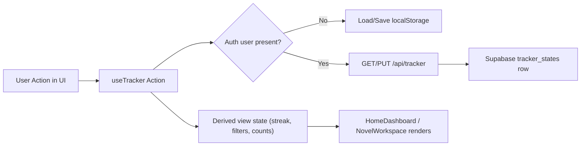

# Novelts Architecture (High Level)

## What This App Is
Novelts is a Next.js app for tracking novels, notes, words, characters, and writing check-ins.
It is local-first by default, and switches to cloud-backed state when a user is authenticated.

## Core Building Blocks
- Framework: Next.js App Router (`app/`)
- UI: React client components + Tailwind CSS (`components/`, `app/globals.css`)
- Auth: Clerk (`ClerkProvider`, Clerk middleware, client/server auth helpers)
- Cloud storage: Supabase (`tracker_states` table storing one JSON snapshot per user)
- Local storage: Browser `localStorage` when user is signed out

## Route-Level Composition
- `/` -> Home dashboard (`HomeDashboard`)
- `/novels/[novelId]` -> Focused novel workspace (`NovelWorkspace`)
- `/5` -> Redirects to `/` (legacy alias)
- Global wrapper (`app/layout.tsx`) injects:
  - `ClerkProvider` for auth context
  - `AuthBar` for login/signup/logout/user controls

## High-Level Module Responsibilities
- `components/HomeDashboard.tsx`
  - Shows top-level metrics and check-in calendar
  - Adds/deletes novels
  - Links into focused workspace pages
- `components/NovelWorkspace.tsx`
  - Per-novel editor for notes, characters, and words
  - Supports editing/pinning/deleting note content
  - Supports recovery path if a workspace is opened with route params but novel is missing locally
- `lib/useTracker.ts` (main state orchestrator)
  - Central state/actions used by both major pages
  - Decides sync mode (`local` vs `cloud`) from Clerk auth state
  - Loads initial state and persists changes
  - Enforces domain rules (soft deletes, allowed check-in dates, auto check-ins from note/word/character writes)
- `app/api/tracker/route.ts`
  - Authenticated API for reading/writing full tracker state
  - `GET`: load current user snapshot
  - `PUT`: upsert snapshot for current user
- `lib/server/supabaseAdmin.ts`
  - Creates/caches Supabase admin client from environment variables

## Data Model (Single State Snapshot)
The app treats tracker data as one normalized state object:
- `novels[]`
- `notes[]`
- `words[]`
- `characters[]`
- `checkIns{}` map keyed by date (`YYYY-MM-DD`)

Cloud mode stores this full object in `tracker_states.state` (`jsonb`).

## How Data Flows

## Runtime Behavior
1. App loads under `RootLayout` with Clerk auth context.
2. `useTracker` waits for auth readiness.
3. If signed in:
   - Fetches state from `/api/tracker`
   - Writes subsequent state updates back via `PUT`
4. If signed out:
   - Loads state from localStorage
   - Persists updates to localStorage
5. UI reads from the same hook and dispatches actions (add/edit/check-in/delete).

## Domain Rules (High Level)
- Soft delete strategy:
  - Novels/notes are hidden by adding a `deleted` tag, not hard removed.
- Check-in window:
  - Manual check-ins limited to today, yesterday, and two days ago.
- Auto check-in:
  - Saving notes/words/characters can create a check-in if one does not exist for that date.
- Streaks:
  - Calculated from check-in dates and exposed as derived state.

## Backend Storage Shape
Supabase schema defines:
- `tracker_states.user_id` (primary key)
- `tracker_states.state` (`jsonb` snapshot)
- timestamps (`created_at`, `updated_at`) with update trigger
- row-level policies for per-user access (for JWT-based flows)

The current API route uses server-side auth + service-role Supabase client to upsert/read per-user snapshots.

## Configuration Boundaries
- Clerk keys configure authentication.
- Supabase URL/service role key configure cloud sync API.
- Without auth or cloud env, the app still functions in local-first mode.

## Mental Model
Think of Novelts as a single client-side state machine (`useTracker`) with two interchangeable persistence adapters:
- guest mode adapter -> `localStorage`
- signed-in mode adapter -> `API -> Supabase`

The UI components are primarily projections and editors of that shared state.
